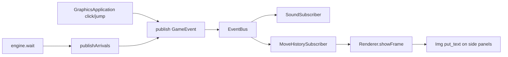

# Graphics move history with timestamps

## Corrections (mandatory)

- **Graphics-only:** do not touch `GameSession`, `MoveLogSubscriber`, or any server path. `timeMs` and move-history logic live only in the single-process graphics app.
- **Captures:** always append a separate short line under the capturer’s color list when `PieceCaptured` arrives — never merge/fold into a move line.
- **Phased delivery:** implement sections 1–3 first (verify compile + temp stdout prints), then sections 4–6 (Img/Renderer panels).

## Approach

Widen the graphics window: **White panel | board | Black panel**. A new `MoveHistorySubscriber` accumulates move lines from `GameEvent`; `Renderer` draws them each frame. Timestamps use the engine’s realtime clock (`clockMs`), not wall clock, so they match `wait` / motion time.

## 1. Stamp events with game time

- Add `long long timeMs = 0` to [`GameEvent`](include/bus/GameEvent.h).
- Expose `long long elapsedMs() const` on [`GameEngine`](include/engine/GameEngine.h) that returns the arbiter’s private `clockMs` (add a const getter on [`RealTimeArbiter`](include/realtime/RealTimeArbiter.h)).
- In [`GraphicsApplication::publish`](src/GraphicsApplication.cpp), set `event.timeMs = engine_.elapsedMs()` before `bus_.publish` (mutate a local copy).
- Do **not** change server or `MoveLogSubscriber`.

## 2. Fill from / to in graphics (match server)

In `GraphicsApplication`, when publishing moves/jumps/captures/promotions, set algebraic squares via [`protocol::positionToSquare`](include/protocol/Algebraic.h) (same helper as server uses; protocol is not the server layer):

- **MoveMade**: `from` + destination cell → `from` / `to`
- **JumpMade**: same square for both
- **PieceCaptured** / **PiecePromoted**: set `to` from arrival cell

## 3. `MoveHistorySubscriber` (bus layer)

New files: `include/bus/MoveHistorySubscriber.h`, `src/bus/MoveHistorySubscriber.cpp`.

- Implements `IGameEventListener`.
- On `MoveMade` / `JumpMade`, append a structured entry: `{ color, timeMs, piece, from, to, isJump }`.
- On `PieceCaptured`, always append a **separate** short line under the capturer’s color (e.g. `3.2s  capture bN on e4`) — never fold into the prior move line.
- Keep two lists (White / Black), cap at ~20 visible lines (drop oldest).
- Expose `const std::vector<…>& whiteEntries() const` / `blackEntries()` and a display-line formatter.
- Format helper (file-local in `.cpp`): token `wP` → `Pawn`, `bN` → `Knight`, etc. (English). Line examples: `3.2s  Pawn e2-e4` / `5.1s  JUMP Pawn e4` / `6.0s  capture bN on e4`.

Register in [`build.bat`](build.bat) and [`CMakeLists.txt`](CMakeLists.txt). Subscribe from `GraphicsApplication` next to `sound_`. For phase 1 verification, print formatted entries to stdout when appended.

## 4. Wider canvas + click mapping

Window is currently board-only (800×800). Extend [`Img`](include/view/Img.h):

- `Img& create(int w, int h, const cv::Scalar& fill)` — blank BGR(A) canvas (OpenCV stays inside `Img.cpp`).

In `GraphicsApplication` ctor / `graphics_main` wiring:

- Build composite background: `create(boardW + 2*panelW, boardH, dark)` → blit board at `x = panelW` via `draw_on`.
- Constants: `kPanelWidth ≈ 220`.
- Construct `BoardMapper` with board origin offset so clicks on panels are off-board (ignore / clear selection only for board rect). Today mapper assumes `(0,0)` origin — extend `BoardMapper` with optional `originX`/`originY`, or subtract `panelW` before `pixelToCell`.

## 5. Draw history in `Renderer`

Extend [`Renderer::showFrame`](include/view/Renderer.h) with history lines (or a small DTO), e.g. white/black `vector<string>` plus `panelWidth` / `boardWidth`.

Each frame after sprites:

- Dark fill already part of composite background (or redraw panel rects).
- Headers: `WHITE` / `BLACK`.
- Draw newest-at-bottom (or top) with `Img::put_text` in each panel; small font (`~0.4`), white/light gray.
- GAME OVER banner stays centered on the **board** region only (not full window), so panels remain readable.

## 6. Docs

Update [`.cursor/rules/agents.mdc`](.cursor/rules/agents.mdc), [`AGENTS.md`](AGENTS.md), and [`.cursor/rules/architecture.mdc`](.cursor/rules/architecture.mdc) briefly: `MoveHistorySubscriber`, `GameEvent::timeMs`, graphics side panels, `Img::create`.

## Out of scope

- Score panel / `ScoreUpdated` in graphics
- Persisting history to disk
- Hebrew piece names (keep English: Pawn, not “soldier”)
- Any server / `MoveLogSubscriber` / online path changes

## Verify

- Phase 1 (`.\build.bat graphics`): moves/jumps/captures print history lines with times to stdout.
- Phase 2: confirm panels, move lines with times on screen, clicks still map to board cells only.
