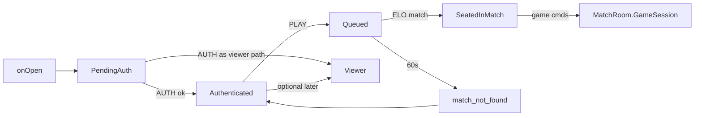
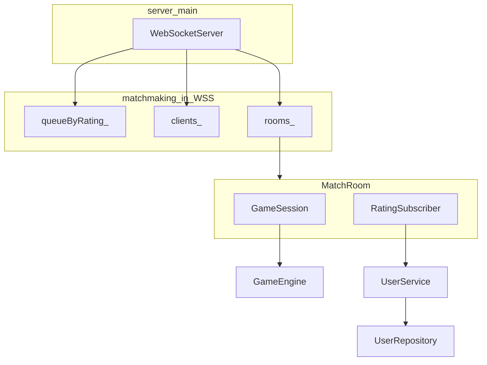

# Matchmaking Architecture Proposal

## Defaults (locked for this design)

- Wire: `AUTH` stays first; new command `PLAY` enters the queue (maps to a client “Play” button). No auto-queue on AUTH.
- Colors: earlier waiter = `'W'`, matched opponent = `'B'` (same ordering idea as today, scoped to the pair).
- ELO window: `|ratingA - ratingB| <= 100`. Among candidates in that window, pick the one with the **earliest `queuedAt`** (not flat FIFO over the whole queue).
- Timeout: 60s from queue join → JSON error `match_not_found`, then remove from queue (client may send `PLAY` again).
- 3rd+ connections: **Viewer** role (not rejected, not a player). Full viewer broadcast/UI is out of scope (Rooms feature later).

---

## Current → target flow



Today AUTH both authenticates **and** seats on the one global session. After this design, AUTH only authenticates; seating happens only when a match is formed. Extra connections that should not play become `Viewer`.

---

## 1. Session registry

### Replace

- Remove the single `GameSession session_` member from [`WebSocketServer`](include/server/WebSocketServer.h).
- Do **not** create a `GameSession` at server startup.

### Add: `MatchRoom` (owned by the server)

New type (e.g. in `include/server/MatchRoom.h` / `src/server/MatchRoom.cpp`), one instance per live match:

| Field | Role |
|-------|------|
| `int matchId` | Stable id (monotonic counter on `WebSocketServer`) |
| `GameSession session` | Created **when the match is found** (constructor still calls `startNewGame()` as today) |
| `RatingSubscriber rating` | Per-room; subscribed to **this** session’s bus |
| `ConnectionHdl white` / `black` | The two seated handles (or a small `map<char, ConnectionHdl>`) |

Optional: also subscribe existing `MoveLogSubscriber` / `SoundSubscriber` to each new room’s bus (same global subscriber instances as today, multi-subscribe), so logging/sound keep working without forking game logic.

### Connection → session mapping

Unify today’s split maps into one connection record (name suggestion: `ClientConn`), keyed by `ConnectionHdl`:

| Field | Purpose |
|-------|---------|
| `username` | Set on AUTH |
| `rating` | Cached at AUTH (avoids DB on every queue lookup) |
| `state` | `PendingAuth` / `Authenticated` / `Queued` / `Seated` / **`Viewer`** |
| `queuedAt` | Steady-clock time when `PLAY` was accepted (timeout + earliest-match pick) |
| `matchId` | Valid only when `Seated` |
| `color` | `'W'`/`'B'` when seated; unset otherwise |

Registry on `WebSocketServer`:

```text
clients_     : map<ConnectionHdl, ClientConn>
rooms_       : map<int, unique_ptr<MatchRoom>>   // matchId → room
nextMatchId_ : int
queueByRating_ : map<int /*rating*/, list<ConnectionHdl>>   // rating-bucketed waiters
```

`seats_`, `usernames_`, `pending_` become redundant and are folded into `clients_` + `queueByRating_`.

Lookup path for a game command: `clients_[hdl].matchId` → `rooms_[id]` → `session.handleCommand(color, line)` → broadcast JSON **only** to that room’s two player handles (replace today’s `broadcastJson` over all `seats_`). Viewers are not included in this v1 broadcast.

### Viewer role (replaces hard `server_full` reject)

- **Do not** reject a 3rd+ connection with `server_full` / close.
- A connection that is connected (and may AUTH) but must **not** play is assigned `ClientConn.state = Viewer`.
- `Viewer` must **never** enter `queueByRating_`, never receive a seat, never call `PLAY` successfully (reject with a clear reason if they try).
- Full spectator receive-path / UI / per-room viewer lists are **out of scope** for this matchmaking proposal (Rooms feature later).
- At the assignment / message-routing point in code, leave an explicit marker:

```cpp
// TODO: full viewer support (Rooms feature)
```

Minimal v1 behavior: accept the connection, allow AUTH if desired, keep state `Viewer` (or transition to `Viewer` when they are not in the play path), send no game seats. Exact policy for “when does Authenticated become Viewer vs stay eligible for PLAY” can stay: anyone may AUTH + PLAY for matchmaking; viewers are connections that are present but not in a play/seat path — implement as “not rejected, not seated, not queued” with the TODO above rather than full Rooms semantics.

---

## 2. Matchmaking queue (rating-bucketed)

### Where it lives

Inside `WebSocketServer` only (no new layer under engine).

Structure:

```text
std::map<int /*rating*/, std::list<ConnectionHdl>> queueByRating_;
```

- Username / rating / `queuedAt` live on `ClientConn`.
- Insertion: `queueByRating_[rating].push_back(hdl)` — map insert/find is **O(log n)**; list push is O(1).
- Removal: erase handle from its rating’s list (and erase empty bucket if needed) — find bucket O(log n), erase from list O(k_bucket) or O(1) if an iterator is stored on `ClientConn` for O(1) list erase.

### When it is checked

1. **On `PLAY`** (primary): after validating state is `Authenticated` (not `Viewer`, not already queued/seated), set `Queued` + `queuedAt`, insert into `queueByRating_`, then run `tryMatch(hdl)`:
   - Let `r` = joiner rating. Use `lower_bound(r - 100)` / `upper_bound(r + 100)` on `queueByRating_` so only buckets in the ELO window are visited — **do not** scan the full queue.
   - Among candidates in that range (other waiters still `Queued`, not self), pick the one with the **earliest `queuedAt`**.
   - If found → `createMatch(earliestWaiter, joiner)` (earlier waiter = White).
   - If not → send a lightweight “searching” JSON (new serializer helper) and leave them waiting.
2. **On tick** (secondary): only for **timeouts**, not for re-matching. With a fixed ±100 window, a new `PLAY` is enough to discover pairs.

**Complexity:** old flat-queue design was **O(n)** per `PLAY`. New design is **O(log n + k)** where `k` = number of candidates in the ±100 ELO window (typically small).

### Match transition (`createMatch`)

1. Allocate `matchId = nextMatchId_++`.
2. `make_unique<MatchRoom>(matchId, users_)` → constructs `GameSession` (board starts now).
3. `rating.setSeat('W', …)` / `setSeat('B', …)`; subscribe rating (and log/sound) to `session.bus()`.
4. Remove both from `queueByRating_`; set both clients to `Seated` with `matchId` + color.
5. Send each: seat assignment via existing `serializeWelcomeJson(color)` + initial `serializeGameStateJson` (same payloads as today’s post-seat path in `seatAfterAuth`).
6. Insert into `rooms_`.

`UserService` / DB are not consulted again at match time (rating already on `ClientConn`).

### AUTH change (important)

[`handleAuth` / `seatAfterAuth`](src/server/WebSocketServer.cpp) must **stop** assigning W/B and must **not** attach the client to any `GameSession`.

- `auth_ok` should omit seat color (or send no color / empty) — small protocol tweak in [`serializeAuthOkJson`](src/protocol/StateSerializer.cpp).
- **Replace** the hard `connectedCount() >= 2` / `server_full` reject in `onOpen` (and AUTH) with the **Viewer** path above — do not leave the server unbounded without role distinction; do not reject 3rd+ clients either.

---

## 3. Timeout handling (non-blocking)

Reuse the existing `asio::steady_timer` / `onTick` (~50ms) in [`WebSocketServer::onTick`](src/server/WebSocketServer.cpp):

```text
onTick:
  1. expireQueueEntries()     // compare now - queuedAt >= 60s
  2. for each room in rooms_: // existing game tick, scoped broadcast to players
       session.tick(kTickMs)
       broadcast to room’s two player clients if needed
  3. scheduleTick()
```

`expireQueueEntries()`:

- Walk queued clients (via buckets or a side index of queued handles); for age ≥ 60s: remove from `queueByRating_`, set state back to `Authenticated`, `sendJson(hdl, serializeErrorJson("match_not_found"))`.
- Never `sleep`, never block the io_service.

Disconnect while queued: erase from `queueByRating_` + `clients_`.

### Disconnect while seated (placeholder + explicit TODO)

v1 may tear down the room and notify the opponent with a temporary message, but this is **not** the final disconnect-handling spec. At the seated-disconnect path in code, mark clearly:

```cpp
// TODO: implement 20s auto-resign with countdown per spec
```

Do not treat “`opponent_disconnected` → reset to `Authenticated`” as the finished behavior for that spec item (comes later).

---

## 4. Impact assessment

### Must change

| Area | Files | What |
|------|--------|------|
| Server | [`include/server/WebSocketServer.h`](include/server/WebSocketServer.h), [`src/server/WebSocketServer.cpp`](src/server/WebSocketServer.cpp) | Multi-room registry, `ClientConn` (+ `Viewer`), rating-bucketed queue, `PLAY`, timeout, per-room tick/broadcast; remove single `session_` and immediate seat-after-AUTH; stop `server_full` reject |
| New | `include/server/MatchRoom.h`, `src/server/MatchRoom.cpp` | Owns `GameSession` + per-match `RatingSubscriber` wiring |
| Protocol | [`include/protocol/StateSerializer.h`](include/protocol/StateSerializer.h), [`src/protocol/StateSerializer.cpp`](src/protocol/StateSerializer.cpp) | `auth_ok` without forced seat; helpers for `searching` / keep using `error` + `match_not_found` |
| Tests | [`test_auth.py`](test_auth.py) | **Required** update for new AUTH-only flow (see section 5) |
| Build | [`build.bat`](build.bat), [`CMakeLists.txt`](CMakeLists.txt) | Register new `MatchRoom.cpp` |
| Docs | [`AGENTS.md`](AGENTS.md), [`.cursor/rules/agents.mdc`](.cursor/rules/agents.mdc), [`.cursor/rules/architecture.mdc`](.cursor/rules/architecture.mdc) | Document AUTH → PLAY → match; multi-session; Viewer stub + Rooms TODO |

### Likely touch (small)

| Area | Why |
|------|-----|
| [`RatingSubscriber`](include/bus/RatingSubscriber.h) | API stays; **instantiation moves** from one server-owned instance to one-per-`MatchRoom`. No algorithm change. |
| [`src/server_main.cpp`](src/server_main.cpp) | Only if it assumes single-session messaging in comments / startup text. |

### No change (confirmed)

- `model/`, `rules/`, `realtime/`, `engine/GameEngine` — still one engine **inside** each `GameSession`; matchmaking never enters those layers.
- `GameSession` public API (`startNewGame`, `handleCommand`, `tick`, `bus`) — keep as-is; only **lifetime/ownership** changes (many sessions, create-on-match).
- `AuthController` / `UserService` / `UserRepository` — AUTH path unchanged; optional later `UserService::getRating` is **not** required if rating is cached on `ClientConn` at login.
- Graphics / console / texttests engine path — out of scope unless a networked client is updated separately.

---

## 5. `test_auth.py` updates (required)

[`test_auth.py`](test_auth.py) currently assumes the **old** post-AUTH seat flow. After AUTH no longer auto-seats, these assertions **must** change as part of implementation (not left as “will still work”).

### `test_new_user` (lines ~6–12)

| Current expectation | Required change |
|---------------------|-----------------|
| `recv()` → `auth_required` | Keep |
| after `AUTH tehila 1234` → `auth_ok` with rating 1200 | Keep (`auth_ok`; rating still present; **no seat color** or empty color per protocol tweak) |
| next `recv()` → `welcome` | **Remove** — `welcome` is only after successful match, not after AUTH |
| next `recv()` → initial game state | **Remove** — state is only after match |

Optional follow-up in the same or a new test: send `PLAY`, then either assert `searching` (alone) or, with a second client in range, assert `welcome` + state on both.

### `test_wrong_password` (lines ~14–19)

| Current | Change |
|---------|--------|
| expects `bad_password` error after wrong AUTH | Keep (AUTH failure path unchanged) |

### `test_correct_login` (lines ~21–26)

| Current | Change |
|---------|--------|
| after correct AUTH → `auth_ok` with same rating | Keep |
| Does not currently assert `welcome`/state | Still valid; ensure it does **not** start expecting seat messages |

### `test_malformed` (lines ~28–34)

| Current | Change |
|---------|--------|
| non-AUTH before auth → `invalid_auth` / rejected | Keep (pending-auth gate unchanged) |

**Summary:** the only scenario that **breaks** today is `test_new_user`’s two extra `recv()` calls for `welcome` and initial state. Those must be dropped (or moved behind an explicit `PLAY` + match setup). Updating this file is a **must-change** deliverable of the matchmaking work, not optional cleanup.

---

## Layering sketch



Dependencies still point inward: matchmaking stays in `server/`; it only **constructs** `GameSession` and uses `auth/` + `protocol/` + `bus/` as today.

---

## Out of scope for this proposal (explicit)

- **Full viewer broadcast/UI** — stub `Viewer` state + `// TODO: full viewer support (Rooms feature)` only.
- **20s auto-resign disconnect** — placeholder teardown only + `// TODO: implement 20s auto-resign with countdown per spec`.
- Expanding ELO window over the 60s wait.
- Rematch / return-to-queue UX beyond “back to Authenticated”.
- Client UI “Play” button implementation (server wire only: `PLAY`).
